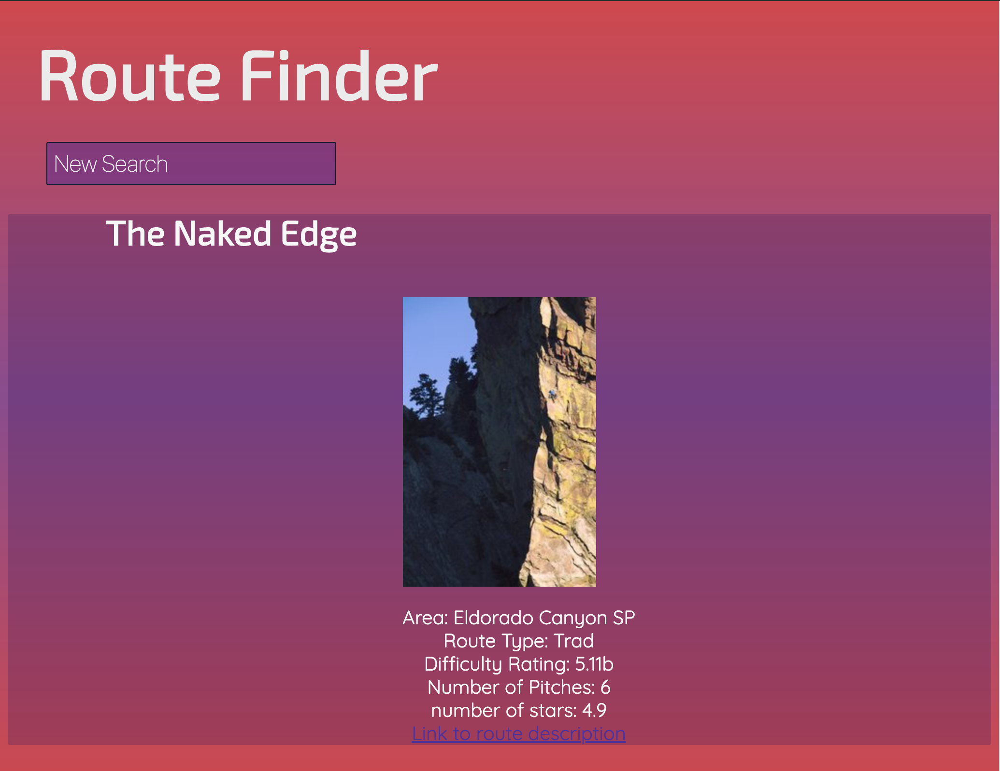
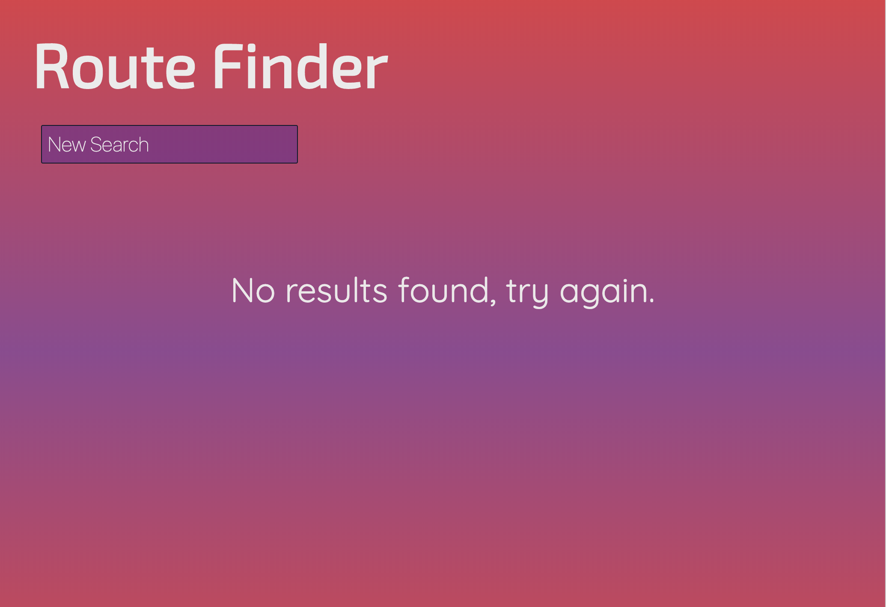

# routeFinder-app
An app for finding the nearest rock climbing routes - Users Come to the site to quickly and easily find the most accessable climbing to their location by making a quick search using the search form, and viewing results on the following page.  in addition, users can look up additional information about rock climbing routes by clicking the provided link for each route.

Live app: https://jbohme13.github.io/routeFinder-app/

Home screen:

Search for mapped natural feature, city, or address.  add optional search parameters; max distance from searched address, minimum difficulty of routes shown, and Maximum difficulty of routes shown.  When all search parameters are set, hit submit for results.

Results screen:

Results are oriented from closest to farthest from search location.  scroll down to see more, and click new search button to return to home screen.

No results screen: 

If your search yields no results, a message will display telling there are no results and to please try again.

Technology used:
- HTML5
- CSS3
- JavaScript
- JQuery

