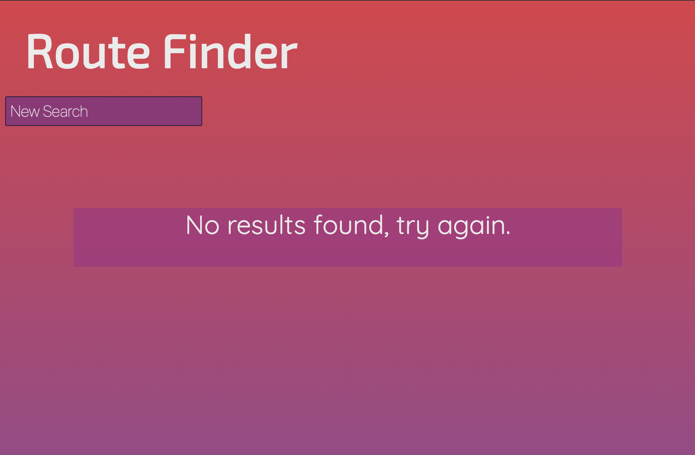

# routeFinder-app
an app for finding the nearest rock climbing routes

Live app: https://jbohme13.github.io/routeFinder-app/

Home screen:

Search for mapped natural feature, city, or address.  add optional search parameters; max distance from searched address, minimum difficulty of routes shown, and Maximum difficulty of routes showm.  When all search parameters are set, hit submit for results.

Results screen:

results are oriented from closest to farthest from search location.  scroll down to see more, and click new search button to return to home screen.

No results screen: 

If your search yeilds no results, a message will display Telling there are no results and to please try again.

